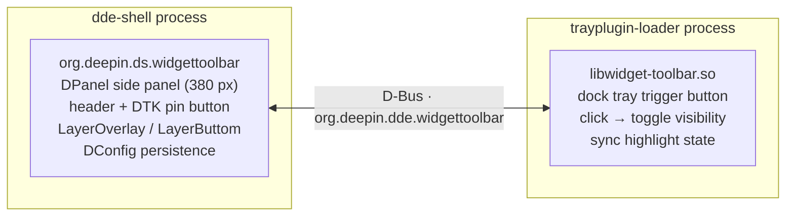

<div align="center">

# 🧩 deepin-widget-toolbar


A Vista-style widget toolbar for the deepin desktop, built on the dde-shell plugin system.

</div>

🌐 **Languages**: [English](README.md) | [简体中文](README.zh-Hans.md) | [文言文](README.zh-Pre-Qin.md)

## ✨ Features

- **📐 Side Panel**: A persistent sidebar anchored to the right edge of the screen, same width as the notification center (380 px)
- **🧩 Widget Grid**: 4-column grid layout with unlimited vertical scrolling (DDE-styled scrollbar, auto-hidden when idle); widgets occupy `cols × rows` cells
- **🖱️ Drag & Arrange**: long-press to drag a widget to any cell (including off the first column); positions persist with no forced reflow; while dragging, occupied widgets move aside live in both directions (multiple widgets coordinated, animated), snapping back on cancel; the bottom-left Arrange button packs widgets to the top-left
- **➕ Add Panel**: The "Add" button at the bottom opens a popup (translucent blur, system corner radius, round close button, no title bar) listing built-in and added widgets, with `.dwpkg` (tar.xz) import and third-party uninstall
- **🕐 Built-in Widgets**: Clock, Calendar, System Monitor, Sticky Note (per-instance persisted data), World Time, and a full-width Ter-Music Lyrics widget
- **🔌 Open API**: manifest + instance context injection (`dataDir`/`instanceId`) + host capability proxies (`FileIO`/`SystemInfo`/`Lyrics`); spec in [widget-api.md](widget-api.md)
- **📌 Pin / Unpin**: A DTK pin button in the header toggles between *pinned* (always above other windows, `LayerOverlay`) and *unpinned* (covered by normal windows, `LayerButtom`)
- **🔘 Dock Trigger Button**: A dde-dock tray plugin toggles the panel visibility — the only way to show or hide it, no auto-hide on focus loss
- **💾 State Persistence**: `visible` and `pinned` states are persisted via DConfig and restored on restart; widget instances are stored in `~/.local/share/org.deepin.ds.widgettoolbar/installed.json`
- **🌐 i18n**: all QML strings use `qsTr`, 23-language `.ts` files (Simplified Chinese translated)
- **🖥️ Multi-screen**: The panel follows the screen where the dock resides

## 🏗️ Architecture

Two plugins communicate over the session bus D-Bus:



- **Panel** (`panel/`): a dde-shell `DPanel` plugin (`org.deepin.ds.widgettoolbar`) that registers the D-Bus service `org.deepin.dde.widgettoolbar` with `toggle()` / `show()` / `hide()` methods and `visible` / `pinned` properties.
- **Tray button** (`tray/`): a dde-tray-loader plugin (`PluginsItemInterfaceV2`, `Type_Tray`) that acts as a D-Bus client, toggling the panel and reflecting its visibility state.

## 📋 Requirements

- deepin / UOS v25 with dde-shell 2.0.52+ (runtime)
- Qt 6.8+ and DTK 6 development packages
- `libdde-shell-dev` (2.0.52)
- dde-tray-loader 2.0.38 (runtime, for the tray plugin)

## 🚀 Building

```bash
cmake -S . -B build
cmake --build build -j$(nproc)
```

## 📦 Installation

```bash
sudo ./install.sh          # cmake --install build
systemctl --user restart dde-shell@DDE
```

## 🖱️ Usage

1. Click the widget-toolbar button in the dock tray area to show or hide the panel.
2. Click the pin button in the panel header to toggle pinned / unpinned:
   - **Pinned**: the panel stays above all windows and is never hidden by clicking elsewhere.
   - **Unpinned**: normal windows can cover the panel.
3. The visibility and pin states survive a restart.

## ⚠️ Known limitations

- **Unpinned mode no longer reserves work area**: the panel no longer declares an `exclusionZone` when unpinned (which maps to `_NET_WM_STRUT_PARTIAL` on X11, and shrinks the usable area of other layer-shell windows on Wayland). That declaration used to shrink the work area, leaving black bars on the screen edges for fullscreen/maximized windows; with it removed, fullscreen and maximized windows behave normally again, and unpinned mode keeps only its `LayerButtom` "can be covered by normal windows" semantics.
- **Desktop icons do not dodge the panel**: the deepin desktop icons (dde-desktop) compute their usable area solely as `screen geometry − dock's frontendWindowRect` and never read the work area / strut. So when unpinned, the panel covers the rightmost column of desktop icons, and no plugin-side mechanism can change that. Making the icons dodge the panel requires patching `ScreenQt::availableGeometry()` in dde-file-manager (explicitly out of scope for this plugin).

## ✅ Verification

- Panel appears on the right edge, 380 px wide, with a title and a pin button.
- The dock tray button toggles the panel; its highlight follows the panel state.
- Pinned panels are not covered by normal windows; unpinned panels can be.
- Clicking outside the panel never closes it.
- States persist across restarts.

## 📁 Directory Layout

```
deepin-widget-toolbar/
├── CMakeLists.txt          # top-level build (panel + tray)
├── install.sh              # system install script
├── LICENSE                 # GNU GPL v3 full text
├── docs/                   # documentation
│   ├── README.md           # this file (English)
│   ├── README.zh-Hans.md   # Simplified Chinese
│   ├── README.zh-Pre-Qin.md# Classical Chinese (Pre-Qin style)
│   └── widget-api.md       # widget open API spec (v0.1)
├── panel/                  # dde-shell DPanel plugin
│   ├── widgettoolbarpanel.*# DPanel + D-Bus service + widget host
│   ├── widgetmanager.*     # widget scanning / installed.json / grid slot / .dwpkg import
│   ├── widgetmodel.*       # widget list model (add panel)
│   ├── fileio.*            # host capability proxy: file I/O (QML singleton)
│   ├── systeminfo.*        # host capability proxy: CPU/mem/disk (QML singleton)
│   ├── lyricssource.*      # host capability proxy: Ter-Music lyrics via D-Bus (QML singleton)
│   ├── widgetresources.qrc # built-in widget resource registration
│   ├── configs/            # DConfig metadata
│   └── package/            # QML UI
│       ├── main.qml        # sidebar: 4-column grid + scrollbar + add button
│       ├── AddWidgetPopup.qml  # add-widget popup panel
│       ├── PinButton.qml   # pin button
│       └── widgets/        # built-in widgets (clock/calendar/systemmonitor/todo/worldtime/lyrics)
└── tray/                   # dde-tray-loader plugin
    ├── widgettoolbartrayplugin.*  # PluginsItemInterfaceV2
    ├── traybutton.*        # dock button + D-Bus client
    ├── interfaces/         # vendored dde-tray-loader 2.0.38 headers
    └── icons/              # button icon (QRC)
```

## 📜 License

This project is licensed under the [GNU General Public License v3.0](../LICENSE) (or later).

The interface headers under `tray/interfaces/` are from [dde-tray-loader](https://github.com/linuxdeepin/dde-tray-loader), licensed under LGPL-3.0-or-later (see the file headers).
