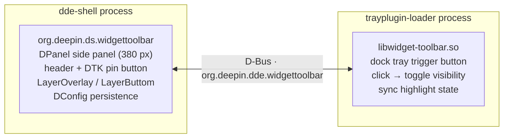

<div align="center">

# 🧩 deepin-widget-toolbar


A Vista-style widget toolbar for the deepin desktop, built on the dde-shell plugin system.

</div>

🌐 **Languages**: [English](README.md) | [简体中文](README.zh-Hans.md) | [文言文](README.zh-Pre-Qin.md)

## ✨ Features

- **📐 Side Panel**: A persistent sidebar anchored to the right edge of the screen, same width as the notification center (380 px)
- **🧩 Widget Grid**: 4-column grid layout with unlimited vertical scrolling (DDE-styled scrollbar, auto-hidden when idle); widgets occupy `cols × rows` cells
- **🖱️ Drag & Arrange**: long-press to drag a widget to any cell (including off the first column); positions persist with no forced reflow; while dragging, occupied widgets move aside live in both directions (multiple widgets coordinated, animated), snapping back on cancel; the bottom-left Arrange button packs widgets to the top-left
- **➕ Add Panel**: The "Add" button at the bottom opens a popup (translucent blur, system corner radius, round close button, no title bar) listing built-in and added widgets, with `.dwpkg` (tar.xz) import and third-party uninstall
- **🖱️ Widget Context Menu**: right-click any widget to switch between manifest-declared sizes (`1×1` / `2×2` / `4×2` / `4×4`), open its per-instance settings, or remove it
- **🕐 Built-in Widgets**: Clock (digital/analog), Calendar, System Monitor (CPU/MEM/DISK/GPU/NPU switches on every size; 2×2 stays single-column, while 4×2 and 4×4 default to dual-column; every size can show all enabled CPU/MEM/DISK IO/GPU/NPU rows with compact single-column rows when needed, configurable 1/2/5-second refresh defaulting to 5 seconds, on-demand background sampling, lightweight static progress bars), Sticky Note (per-instance persisted data), World Time (digital list or resizable analog dial grid; timezones and localized names follow the control-center time settings), a Ter-Music Lyrics widget with configurable font and color, and a Media Player widget (MPRIS metadata/cover, previous/play-pause/next, auto or locked player selection). Clock and World Time can enable preloaded time (default on): all visible dials share one host-side second ticker, and analog faces use cached static dials with GPU-composited hands, so many clocks move together without jank. Every built-in widget also supports per-element theme colors (one default preset + custom color picker) and a transparent-background toggle (default off), with all color inputs validated before rendering
- **🔌 Open API**: manifest (`sizes` + `settings`) + instance context injection (`dataDir`/`instanceId`/`widgetConfig`) + host capability proxies (`FileIO`/`SystemInfo`/`Lyrics`/`ClockTime`/`MediaPlayers`/`MediaPlayer`); spec in [widget-api.md](widget-api.md)
- **📌 Pin / Unpin**: A DTK pin button in the header toggles between *pinned* (always above other windows, `LayerOverlay`) and *unpinned* (covered by normal windows, `LayerButtom`)
- **🔘 Dock Trigger Button**: A dde-dock tray plugin toggles the panel visibility — the only way to show or hide it, no auto-hide on focus loss
- **💾 State Persistence**: `visible` and `pinned` states are persisted via DConfig and restored on restart; widget instances are stored in `~/.local/share/org.deepin.ds.widgettoolbar/installed.json`, and per-instance settings are stored under each widget's data directory
- **🌐 i18n**: all QML strings use `qsTr`, 23-language `.ts` files (Simplified Chinese translated)
- **🖥️ Multi-screen**: The panel follows the screen where the dock resides

## 🏗️ Architecture

Two plugins communicate over the session bus D-Bus:



- **Panel** (`panel/`): a dde-shell `DPanel` plugin (`org.deepin.ds.widgettoolbar`) that registers the D-Bus service `org.deepin.dde.widgettoolbar` with `toggle()` / `show()` / `hide()` methods and `visible` / `pinned` properties.
- **Tray button** (`tray/`): a dde-tray-loader plugin (`PluginsItemInterfaceV2`, `Type_Tray`) that acts as a D-Bus client, toggling the panel and reflecting its visibility state.

## 📋 Requirements

- deepin / UOS v25 with dde-shell 2.0.52+ (runtime)
- Qt 6.8+ and DTK 6 development packages
- `libdde-shell-dev` (2.0.52)
- dde-tray-loader 2.0.38 (runtime, for the tray plugin)

## 🚀 Building

```bash
cmake -S . -B build
cmake --build build -j$(nproc)
```

## 📦 Installation

```bash
sudo ./install.sh          # cmake --install build
systemctl --user restart dde-shell@DDE
```

## 🖱️ Usage

1. Click the widget-toolbar button in the dock tray area to show or hide the panel.
2. Click the pin button in the panel header to toggle pinned / unpinned:
   - **Pinned**: the panel stays above all windows and is never hidden by clicking elsewhere.
   - **Unpinned**: normal windows can cover the panel.
3. The visibility and pin states survive a restart.

## ⚠️ Known limitations

- **Unpinned mode no longer reserves work area**: the panel no longer declares an `exclusionZone` when unpinned (which maps to `_NET_WM_STRUT_PARTIAL` on X11, and shrinks the usable area of other layer-shell windows on Wayland). That declaration used to shrink the work area, leaving black bars on the screen edges for fullscreen/maximized windows; with it removed, fullscreen and maximized windows behave normally again, and unpinned mode keeps only its `LayerButtom` "can be covered by normal windows" semantics.
- **Desktop icons do not dodge the panel**: the deepin desktop icons (dde-desktop) compute their usable area solely as `screen geometry − dock's frontendWindowRect` and never read the work area / strut. So when unpinned, the panel covers the rightmost column of desktop icons, and no plugin-side mechanism can change that. Making the icons dodge the panel requires patching `ScreenQt::availableGeometry()` in dde-file-manager (explicitly out of scope for this plugin).

## ✅ Verification

- Panel appears on the right edge, 380 px wide, with a title and a pin button.
- The dock tray button toggles the panel; its highlight follows the panel state.
- Pinned panels are not covered by normal windows; unpinned panels can be.
- Clicking outside the panel never closes it.
- Right-clicking a widget offers only the sizes declared by its manifest; resizing persists and avoids other widgets; Remove deletes the instance.
- Per-instance clock and lyrics settings apply immediately and survive a restart.
- The system monitor uses lightweight progress bars without continuous animations; 2×2 stays single-column, while 4×2 and 4×4 support dual-column (enabled by default), and every size can display all enabled CPU/MEM/DISK IO/GPU/NPU rows with compact single-column rows when needed; sampling defaults to 5 seconds, runs on a background thread only while visible, and stops when the panel is hidden; the dual-column switch appears on 4×2 and 4×4 instances.
- Clock and World Time use preloaded time by default: every visible clock instance shares the host's single second ticker, and analog dials only update hand rotations instead of repainting whole canvases; disabling the setting falls back to per-instance timers.
- A new World Time instance defaults to analog mode with four dials: the current timezone plus three of the classic four (Beijing/Tokyo/London/New York); clearing all dials in settings is respected and not re-seeded.
- Built-in widgets apply their default theme colors on first use; changing any color or enabling transparent background takes effect immediately and survives a restart, and invalid color values fall back to defaults safely.
- States persist across restarts.

## 📁 Directory Layout

```
deepin-widget-toolbar/
├── CMakeLists.txt          # top-level build (panel + tray)
├── install.sh              # system install script
├── uninstall.sh            # uninstall script (paired with install.sh)
├── build-deb.sh            # Debian packaging script (temp copy dpkg-buildpackage → dist/)
├── LICENSE                 # GNU GPL v3 full text
├── debian/                 # Debian packaging config (control/rules/postinst/postrm)
├── docs/                   # documentation
│   ├── README.md           # this file (English)
│   ├── README.zh-Hans.md   # Simplified Chinese
│   ├── README.zh-Pre-Qin.md# Classical Chinese (Pre-Qin style)
│   ├── widget-api.md       # widget open API spec (v1.2)
│   └── system-monitor.md   # CPU/memory/disk/GPU/NPU metric sources and formulas
├── panel/                  # dde-shell DPanel plugin
│   ├── CMakeLists.txt      # panel build (Dde::Shell + translations + install)
│   ├── widgettoolbarpanel.*# DPanel + D-Bus service (visibility/pin/menu actions) + widget host
│   ├── widgetmanager.*     # widget scanning / installed.json / grid slot / .dwpkg import
│   ├── widgetmodel.*       # widget list model (add panel)
│   ├── fileio.*            # host capability proxy: file I/O (QML singleton)
│   ├── systeminfo.*        # host capability proxy: CPU/mem/disk IO/GPU/NPU (QML singleton)
│   ├── lyricssource.*      # host capability proxy: Ter-Music lyrics A/B buffer (QML singleton)
│   ├── clocktime.*         # host preloaded time source: one aligned second ticker (QML singleton)
│   ├── widgetresources.qrc # built-in widget resource registration
│   ├── configs/            # DConfig metadata
│   ├── translations/       # panel translations (23 languages .ts)
│   └── package/            # QML UI
│       ├── metadata.json   # panel plugin metadata (dde-shell)
│       ├── main.qml        # sidebar: 4-column grid + drag & drop + scroll + context menu + exclusive popups
│       ├── AddWidgetPopup.qml  # add-widget popup panel (PanelPopup framework)
│       ├── SettingsDialog.qml  # settings popup (show panel / pin to top)
│       ├── AboutPopup.qml  # about popup (team / repository / website links)
│       ├── WidgetSettingsPopup.qml # schema-driven per-instance widget settings
│       ├── PopupHeader.qml  # shared popup title bar
│       ├── PinButton.qml   # pin button
│       ├── icons/          # pin/unpin icon assets
│       └── widgets/        # built-in widgets and shared WidgetCard / ColorUtils components
└── tray/                   # dde-tray-loader plugin
    ├── CMakeLists.txt      # tray plugin build (Qt6 + DTK6 + translations + install)
    ├── metadata.json       # plugin metadata (api 2.0.0)
    ├── widgettoolbartrayplugin.*  # PluginsItemInterfaceV2 + context menu + control-center plugin area entry
    ├── traybutton.*        # dock button + D-Bus client
    ├── interfaces/         # vendored dde-tray-loader 2.0.38 headers
    ├── translations/       # tray plugin translations (en/zh_CN .ts)
    └── icons/              # icon assets
        ├── widget-toolbar.svg         # white glyph (dark theme)
        ├── widget-toolbar-dark.svg    # black glyph (light theme)
        ├── widget-toolbar-icons.qrc   # QRC registration (prefix /widget-toolbar, avoids DTK symbol clash)
        └── dcc-widget-toolbar.dci     # control-center plugin area icon (DCI container, light/dark)
```

## 📜 License

This project is licensed under the [GNU General Public License v3.0](../LICENSE) (or later).

The interface headers under `tray/interfaces/` are from [dde-tray-loader](https://github.com/linuxdeepin/dde-tray-loader), licensed under LGPL-3.0-or-later (see the file headers).
