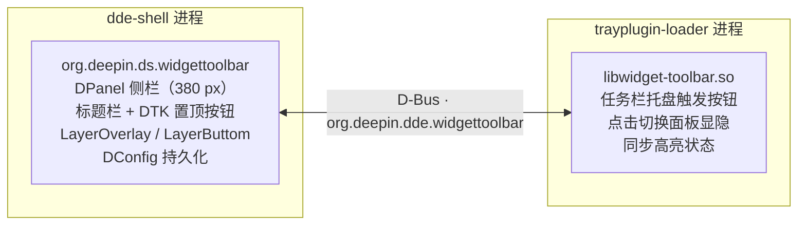

<div align="center">

# 🧩 deepin-widget-toolbar（小组件工具栏）


[](https://github.com/linuxdeepin/deepin-skills)

面向 deepin 桌面、基于 dde-shell 插件体系的 Vista 风格小组件工具栏。

</div>

🌐 **语言**: [English](README.md) | [简体中文](README.zh-Hans.md) | [文言文](README.zh-Pre-Qin.md)

## ✨ 特性

- **📐 侧栏面板**：常驻于屏幕右侧的侧栏，宽度与通知中心一致（380 px）
- **🧩 小组件网格**：4 列网格布局，纵向无限滚动（DDE 样式滚动条，不活跃自动隐藏）；小组件按 `cols × rows` 占格
- **🖱️ 拖放与整理**：长按可把小组件拖到任意格子（含每行非首列）；位置持久保持、不做强制补位；拖拽过程中被占用的小组件会实时双向让位（多个组件联动、带动画），移开或取消则回弹；左下角"整理"按钮按左上优先压实
- **➕ 添加面板**：底部"添加"按钮弹出面板（透明毛玻璃、系统圆角、圆形叉号关闭、无标题栏），陈列内置与已添加小组件，支持 `.dwpkg`（tar.xz）导入与第三方卸载
- **🖱️ 组件右键菜单**：右键任意小组件可切换 manifest 声明的尺寸（`1×1` / `2×2` / `4×1` / `4×2` / `4×4`）、打开按实例保存的配置面板或取消显示
- **🕐 内置小组件**：时钟（数字/指针）、日历、资源监视仪表（所有尺寸都提供 CPU/内存/磁盘 IO/GPU/NPU 开关；2×2 固定单列，4×2/4×4 默认双列，任何尺寸都可显示全部已启用指标，单列时自动压缩行距与行高；刷新间隔可选 1/2/5 秒且默认 5 秒；后台按需采样；使用轻量静态进度条）、便签（按实例隔离持久化；可选*待办模式*：行首圆点空心/实心点击切换，完成行文字变浅并加删除线，内容无限滚动；数据以 XML 持久化，首次加载自动迁移旧 `.txt`）、世界时间（五种规格 `1×1`/`2×2`/`4×1`/`4×2`/`4×4`；数字列表或随尺寸变化的指针表盘网格，`4×1` 长条为单行四格，数字模式隐去标题、格内时间与地区名上下排列；时区与地区名跟随控制中心时间设置）、频谱面板（跟随系统播放的音频自由跃动，幅度与颜色可配置，缺省淡绿背景与主题色频谱）、可配置字体与颜色的端闱乐部歌词小组件，以及播放控制器（MPRIS 曲目/封面，上一曲/播放暂停/下一曲，自动或锁定播放器）、应用快捷启动器（方格单元一软件，五种规格小/中/长/宽/大、缺省为新增的 4×1 长条；按容量显示已配置应用（至多 16 个），未放满时末位出现"+"；新实例自动预置浏览器/终端/文本编辑器/邮箱四个默认程序；逐格程序经三级应用列表设定（图标 + 应用名 + 确认/取消，选中高亮）；标签、标签颜色、启动器底色与卡片底色均可配置，沉浸模式同时隐藏标签与启动器底色；应用条目、默认程序与图标渲染与 dde-shell 同源）。时钟与世界时间支持预加载时间模式（默认开启）：所有可见表盘共享宿主唯一秒级时间源，指针表盘使用缓存静态表盘与 GPU 合成指针，大量表盘可同步运动而不卡顿。所有内置小组件还支持逐元素主题色（一个默认预设 + 自定义取色）与透明背景开关（默认关闭），颜色输入经校验后才渲染
- **🔌 开放接口**：manifest（`sizes` + `settings`）+ 实例上下文注入（`dataDir`/`instanceId`/`widgetConfig`）+ 宿主能力代理（`FileIO`/`SystemInfo`/`Lyrics`/`ClockTime`/`MediaPlayers`/`MediaPlayer`/`AudioVisualizer`/`DesktopApps`），规范见 [widget-api.md](widget-api.md)
- **⚙️ 面板设置**："设置"弹窗（右键 → 设置，或经托盘菜单）提供显示面板、置顶、*卡片透明模式*与*卡片名称显示*四项开关：卡片透明模式开启时所有小组件卡片使用半透明叠层底（默认关闭），与每个小组件自身的透明背景开关相互独立
- **🏷️ 卡片名称**：每张卡片下方居中显示该小组件的（本地化）名称，单行、宽度不超过卡片本身、溢出以 `…` 收尾；**只有全局开关**，刻意不提供单卡片显隐；开启时单元格由正方形变为略高的长方形（格高 = 格宽 + 名称条高 − 4）而非横向压缩卡片，故各卡片宽度与关闭时完全一致、左右边缘仍与列对齐（单行卡片仅矮 4 像素，多行卡片随格高变高）（默认开启）
- **📌 置顶/置底**：标题栏的 DTK 图钉按钮在*置顶*（始终在其他窗口之上，`LayerOverlay`）与*置底*（可被普通窗口覆盖，`LayerButtom`）之间切换
- **🫥 多任务视图避让**：唤起多任务视图（kwin 概览）时——无论经任务栏按钮、Meta+S 还是触摸板——面板临时隐藏避让，置顶与置底两种模式皆然；视图一退出面板立即自动回归，无需再次唤起，持久化的显隐状态与托盘按钮高亮全程不受影响
- **🚪 面板避让**：当其他 DDE 面板在几何上*确实与*右侧栏叠合——通知弹出、通知中心、控制中心、电源/注销对话框、剪贴板面板，或托盘快捷面板与展开小卡（面板自己的 13×13 停驻占位窗不计）——面板同样临时隐藏、待其关闭或移开即时回归（与多任务视图避让同款，共用弹窗收起逻辑）；展开在侧栏之外的小卡不再误隐。仅 X11 生效：依各窗口的 WM_NAME / WM_CLASS 与其在 root 上的绝对矩形识别，而侧栏自身矩形**直接读它自己的 X11 窗口（像素）**，所以面板隐藏期间判定依然精确。避让期间每 2 秒按窗口树真值对账一次、托盘按钮在显示前也会先对账——**任何"没送到的事件"都不会再让面板永久不显示**；目标窗**权威离场**（Unmap/Destroy）即刻解除避让，而可能被一次瞬态误读伪造的"脱靶/不叠合"（空读名、尺寸瞬时跌阈、面板矩形暂不可知）须经两次独立复核确认才释放（复核间隔 500ms）；对账偶尔扫不到的在册避让条目（实测 dde 弹出面会以销毁→重建轮换窗口 id，X11 窗亦被 WM 反复 reparent）改按其自身窗口 id **活性直查**——仍可见即保持避让，唯销毁/不可见（含祖先收起致 UNVIEWABLE）才权威释放，"一时扫不到"不再是离场证据——**避让不再开始几秒后自己悄悄失效**；避让的开始/释放候选/结束与滞留条目清理均以 **warning 级**日志（`panelavoid:` 前缀）记录（dde-shell 默认压掉 info 级），事后一条 journalctl 即可定位
- **🔘 任务栏触发按钮**：dde-dock 托盘插件控制面板显隐——这是显示/隐藏的唯一途径，失焦不会自动关闭
- **💾 状态持久化**：`visible`、`pinned`、卡片透明模式与 `showCardNames` 经 DConfig 持久化，重启后恢复；小组件实例清单存于 `~/.local/share/org.deepin.ds.widgettoolbar/installed.json`，按实例配置存于对应小组件数据目录
- **🌐 国际化**：QML 全量 `qsTr`，23 种语言 `.ts`（简体中文已翻译）
- **🖥️ 多屏支持**：面板跟随任务栏所在的屏幕

## 🏗️ 架构

两个插件通过会话总线 D-Bus 通信：



- **面板**（`panel/`）：dde-shell `DPanel` 插件（`org.deepin.ds.widgettoolbar`），注册 D-Bus 服务 `org.deepin.dde.widgettoolbar`，提供 `toggle()` / `show()` / `hide()` 方法与 `visible` / `pinned` 属性。
- **托盘按钮**（`tray/`）：dde-tray-loader 插件（`PluginsItemInterfaceV2`，`Type_Tray`），作为 D-Bus 客户端切换面板并反映其显隐状态。

## 📋 依赖要求

- deepin / UOS v25，dde-shell 2.0.52+（运行时）
- Qt 6.8+ 与 DTK 6 开发包
- `libdde-shell-dev`（2.0.52）
- dde-tray-loader 2.0.38（运行时，托盘插件需要）

## 🚀 构建

```bash
cmake -S . -B build -DCMAKE_BUILD_TYPE=Release
cmake --build build -j$(nproc)
```

> ⚡ **性能说明**：本地构建请带优化开关 `-DCMAKE_BUILD_TYPE=Release`（官方 Debian 包已是 Release；不带此开关的本地构建按 -O0 编译，性能显著下降）。面板对空闲态做了针对性优化：频谱分析在工作线程执行，无频谱小组件可见时线程休眠在条件变量上（CPU≈0）；分析算法为预计算 twiddle 因子的 128 点基数-2 FFT（替代朴素 DFT）；频谱小组件空闲“呼吸”动画从 30fps 降到约 12fps，音频启动时立即恢复 30fps。面板隐藏时卸载小组件对象树以释放 QML 与纹理内存，显示时异步重建。

## 📦 安装

```bash
./install.sh               # 一键安装：自动构建 + 请求管理员权限部署 + 让新增配置项立即生效 + 重启 dde-shell
./uninstall.sh             # 一键卸载：先后询问是否清除面板设置与小组件数据（y/N），再删除插件与缓存残留 + 重启 dde-shell
```

`./install.sh` 还会让**新增的 DConfig 配置项立即可用**：`dde-dconfig-daemon` 只在启动时解析配置描述文件，所以就地升级后它并不认识新加的键——读还能走插件内置的兜底值（这正是新功能升级后立刻出现的原因），但**写会被拒绝**，用户拨动新开关的选择会在下次重启时被悄悄丢掉。因此当描述文件发生变化、或发现本插件有配置项未被识别时，安装脚本会重启该服务（亚秒级）并逐个复查配置项。

面板设置（显隐、置顶、卡片透明模式、卡片名称）都是 DConfig 配置项，用户每次改动都会形成持久化的*用户覆盖*——**重装会沿用该覆盖**，这正是"卸载重装后卡片透明模式仍是开启"的来源。因此卸载脚本会**询问**是否清除这些覆盖，且只 reset 本插件自己的键（`visible`/`pinned`/`cardTransparent`/`showCardNames`），绝不触碰 dock 等其它 dde-shell 配置。重置必须在插件的配置描述文件仍存在时执行，故这个问题在最前面问、也在删除任何文件之前执行；小组件持久化数据的询问仍留在原有的清理步骤里。回答 `n` 则两者都保留；也可手动只重置某一项：`dde-dconfig reset -a org.deepin.dde.shell -r org.deepin.ds.widgettoolbar -k cardTransparent`。

## 🖱️ 使用

1. 点击任务栏托盘区的小组件工具栏按钮，显示或隐藏面板。
2. 点击面板标题栏的图钉按钮，切换置顶/置底：
   - **置顶**：面板始终位于所有窗口之上，点击面板外空白处不会关闭。
   - **置底**：普通窗口可以覆盖面板。
3. 显隐与置顶状态在重启后保持。

## ⚠️ 已知限制

- **置底模式不再压缩工作区**：置底时面板不再向合成器声明 `exclusionZone`（X11 下对应 `_NET_WM_STRUT_PARTIAL`，Wayland 下影响其他 layer-shell 窗口的可用区域）。此前该声明会收缩工作区，使全屏/最大化窗口在屏幕边缘露出黑边；移除后全屏与最大化窗口恢复正常，置底仅保留"可被普通窗口覆盖"的 `LayerButtom` 语义。
- **桌面图标不会避让面板**：deepin 桌面图标（dde-desktop）的可用区域仅按 `屏幕几何 − dock 的 frontendWindowRect` 计算，不读取工作区/strut。因此置底时面板会盖住屏幕右侧一列图标，且无任何插件侧手段可改变该行为——若需要图标避让，必须修改 dde-file-manager 的 `ScreenQt::availableGeometry()`（本插件明确不包含此改动）。

## ✅ 验证

- 面板出现在屏幕右侧，宽 380 px，带标题与置顶按钮。
- 任务栏按钮切换面板，其高亮跟随面板状态。
- 面板显示中调整任务栏的位置、尺寸或隐藏模式，面板的边距与高度即时跟随，无需隐藏再显示。
- 置顶时面板不被普通窗口覆盖；置底时可以被覆盖。
- 每张卡片下方居中显示名称，超宽处省略号收尾；开启时各卡片宽度与关闭时完全相同（改由格高变高承担，只有单行卡片矮 4 像素），关闭后布局与之前逐像素一致；该开关没有单卡片版本，且重启后保留。
- 点击面板外空白处不会关闭面板。
- 右键小组件只显示其 manifest 声明的尺寸；调整尺寸后位置持久化且与其它组件不重叠；"取消显示"删除该实例。
- 时钟与歌词的实例配置修改后立即生效，重启后保留。
- 系统监视器使用无持续动画的轻量进度条且不超出格子范围；2×2 固定单列，4×2/4×4 支持双列（默认启用），任何尺寸都可显示全部已启用指标，单列时自动压缩行距与行高；采样默认 5 秒，在后台线程执行且面板隐藏时停止；双列开关出现在 4×2/4×4 实例。
- 时钟与世界时间默认使用预加载时间：所有可见时钟实例共享宿主唯一秒级时间源，指针表盘只更新指针旋转而不再整盘重绘；关闭该设置后回退为各实例独立 Timer。
- 频谱面板跟随系统播放的音频（默认 sink 的 monitor 回环）跃动，仅实例可见时采集；跃动幅度（40%–200%）与频谱颜色可配置，缺省淡绿背景与主题色频谱，无音频时平滑呼吸待机；柱体居上三分之二，底部三分之一为渐隐镜像倒影（4×4 大尺寸为二分之一）。
- 世界时间新实例缺省为指针模式并预置四块表盘：当前时区 + 老四样（北京/东京/伦敦/纽约）之三；在设置中清空表盘后不再自动补回。
- 内置小组件首次使用即应用默认主题色；修改任意颜色或开启透明背景立即生效并重启保留，非法颜色值安全回退默认。
- 重启后状态保持。

## 📁 目录结构

```
deepin-widget-toolbar/
├── CMakeLists.txt          # 顶层构建（panel + tray）
├── install.sh              # 一键安装（构建 + sudo 部署 + 刷新 DConfig 配置项 + 重启）
├── uninstall.sh            # 一键卸载（先问面板设置/小组件数据是否清除，再删除 + 清理 + 重启）
├── build-deb.sh            # Debian 打包脚本（临时副本 dpkg-buildpackage → dist/）
├── LICENSE                 # GNU GPL v3 全文
├── debian/                 # Debian 打包配置（control/rules/postinst/postrm）
├── docs/                   # 文档
│   ├── README.md           # 英文
│   ├── README.zh-Hans.md   # 简体中文
│   ├── README.zh-Pre-Qin.md# 文言文（先秦文风）
│   ├── widget-api.md       # 小组件开放接口规范（v1.7）
│   └── system-monitor.md   # CPU/内存/磁盘/GPU/NPU 指标来源与公式
├── panel/                  # dde-shell DPanel 插件
│   ├── CMakeLists.txt      # 面板构建（Dde::Shell + 翻译 + 安装）
│   ├── widgettoolbarpanel.*# DPanel + D-Bus 服务（显隐/置顶/菜单动作）+ 小组件宿主
│   ├── windowguard.*       # X11 窗口层级/几何守护（无边框恢复 + 边距轮询）
│   ├── widgetmanager.*     # 小组件扫描 / installed.json / 网格槽位 / .dwpkg 导入（编排层）
│   ├── widgettypes.h       # 共享基础类型（WidgetInfo / WidgetInstance）
│   ├── widgetgrid.*        # 4 列网格纯算法（空闲槽 / 双向避让）
│   ├── widgetpackage.*     # .dwpkg 校验 / 安装 / 卸载
│   ├── widgetschema.*      # manifest 配置 schema 工具（QML 转换 / 默认值）
│   ├── widgetmodel.*       # 小组件列表模型（添加面板）
│   ├── fileio.*            # 宿主能力代理：文件读写（QML 单例）
│   ├── systeminfo.*        # 宿主能力代理：CPU/内存/磁盘 IO/GPU/NPU（QML 单例）
│   ├── systeminfoworker.*  # 后台指标采样器（CPU/内存/磁盘编排）
│   ├── sysfsreader.*       # sysfs 指标读取工具 + 累积计数器
│   ├── nvmlhelper.*        # NVIDIA NVML 运行时加载器（GPU）
│   ├── gpuhelper.*         # GPU 利用率采样器（NVML/sysfs/Xe idle）
│   ├── npuhelper.*         # NPU 利用率采样器（sysfs）
│   ├── timezones.*         # 时区 D-Bus 代理（QML 单例）
│   ├── timezonedb.*        # 时区数据读取 + DST/缓存层
│   ├── mediaplayer.*       # MPRIS 播放器代理（D-Bus 会话 + 控制）
│   ├── mprisparsing.*      # MPRIS 元数据解析 + 封面来源白名单
│   ├── lyricssource.*      # 宿主能力代理：端闱乐部歌词（A/B 双缓冲，QML 单例）
│   ├── clocktime.*         # 宿主预加载时间源：按整秒对齐的唯一秒级广播（QML 单例）
│   ├── widgetresources.qrc # 内置小组件资源注册
│   ├── configs/            # DConfig 元数据
│   ├── translations/       # 面板翻译（23 种语言 .ts）
│   └── package/            # QML 界面
│       ├── metadata.json   # 面板插件元数据（dde-shell）
│       ├── main.qml        # 侧栏：4 列网格 + 拖放 + 滚动 + 右键菜单 + 互斥弹出面板
│       ├── AddWidgetPopup.qml  # 添加小组件弹出面板（PanelPopup 框架）
│       ├── SettingsDialog.qml  # 设置弹出面板（显示面板/置顶/卡片透明模式）
│       ├── AboutPopup.qml  # 关于弹出面板（开发团队/仓库/官网链接）
│       ├── WidgetSettingsPopup.qml # schema 驱动的组件实例配置面板
│       ├── PopupHeader.qml  # 弹出面板共用标题栏
│       ├── PinButton.qml   # 置顶按钮
│       ├── icons/          # 置顶/取消置顶图钉图标
│       └── widgets/        # 内置小组件
│           ├── components/ # 共用组件：WidgetCard / ColorUtils / WidgetHostItem /
│           │               #   DockMarginHelper / SettingsRow / ColorPickerDialog /
│           │               #   ControlsBar / CoverArt / AnalogClock（含 dialslogic.js）
│           └── <widget>/   # 各小组件目录（main.qml + manifest.json）
└── tray/                   # dde-tray-loader 插件
    ├── CMakeLists.txt      # 托盘插件构建（Qt6 + DTK6 + 翻译 + 安装）
    ├── metadata.json       # 插件元数据（api 2.0.0）
    ├── widgettoolbartrayplugin.*  # PluginsItemInterfaceV2 + 右键菜单 + 控制中心插件区域入口
    ├── traybutton.*        # 任务栏按钮 + D-Bus 客户端
    ├── interfaces/         # vendored dde-tray-loader 2.0.38 头文件
    ├── translations/       # 托盘插件翻译（en/zh_CN .ts）
    └── icons/              # 图标资产
        ├── widget-toolbar.svg         # 白色版图标（深色主题）
        ├── widget-toolbar-dark.svg    # 黑色版图标（浅色主题）
        ├── widget-toolbar-icons.qrc   # QRC 注册（前缀 /widget-toolbar，避免与 DTK 符号冲突）
        └── dcc-widget-toolbar.dci     # 控制中心插件区域图标（DCI 容器，明暗双主题）
```

## 📜 许可证

本项目采用 [GNU 通用公共许可证 v3.0](../LICENSE)（或更高版本）。

`tray/interfaces/` 下的接口头文件来自 [dde-tray-loader](https://github.com/linuxdeepin/dde-tray-loader)，采用 LGPL-3.0-or-later 许可（见文件头）。