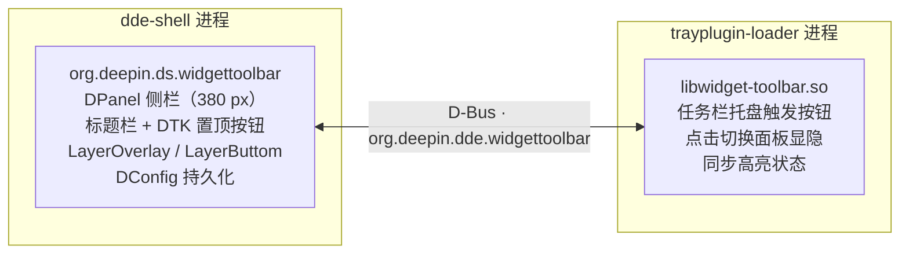

<div align="center">

# 🧩 deepin-widget-toolbar（小组件工具栏）


面向 deepin 桌面、基于 dde-shell 插件体系的 Vista 风格小组件工具栏。

</div>

🌐 **语言**: [English](README.md) | [简体中文](README.zh-Hans.md) | [文言文](README.zh-Pre-Qin.md)

## ✨ 特性

- **📐 侧栏面板**：常驻于屏幕右侧的侧栏，宽度与通知中心一致（380 px）
- **🧩 小组件网格**：4 列网格布局，纵向无限滚动（DDE 样式滚动条，不活跃自动隐藏）；小组件按 `cols × rows` 占格
- **🖱️ 拖放与整理**：长按可把小组件拖到任意格子（含每行非首列）；位置持久保持、不做强制补位；拖拽过程中被占用的小组件会实时双向让位（多个组件联动、带动画），移开或取消则回弹；左下角"整理"按钮按左上优先压实
- **➕ 添加面板**：底部"添加"按钮弹出面板（透明毛玻璃、系统圆角、圆形叉号关闭、无标题栏），陈列内置与已添加小组件，支持 `.dwpkg`（tar.xz）导入与第三方卸载
- **🖱️ 组件右键菜单**：右键任意小组件可切换 manifest 声明的尺寸（`1×1` / `2×2` / `4×2` / `4×4`）、打开按实例保存的配置面板或取消显示
- **🕐 内置小组件**：时钟（数字/指针）、日历、资源监视仪表（可配置 CPU/内存/磁盘 IO/GPU/NPU 显示与刷新间隔）、便签（按实例隔离持久化）、世界时间（数字列表或随尺寸变化的指针表盘网格，时区与地区名跟随控制中心时间设置），以及可配置字体与颜色的端闱乐部歌词小组件
- **🔌 开放接口**：manifest（`sizes` + `settings`）+ 实例上下文注入（`dataDir`/`instanceId`/`widgetConfig`）+ 宿主能力代理（`FileIO`/`SystemInfo`/`Lyrics`），规范见 [widget-api.md](widget-api.md)
- **📌 置顶/置底**：标题栏的 DTK 图钉按钮在*置顶*（始终在其他窗口之上，`LayerOverlay`）与*置底*（可被普通窗口覆盖，`LayerButtom`）之间切换
- **🔘 任务栏触发按钮**：dde-dock 托盘插件控制面板显隐——这是显示/隐藏的唯一途径，失焦不会自动关闭
- **💾 状态持久化**：`visible` 与 `pinned` 状态经 DConfig 持久化，重启后恢复；小组件实例清单存于 `~/.local/share/org.deepin.ds.widgettoolbar/installed.json`，按实例配置存于对应小组件数据目录
- **🌐 国际化**：QML 全量 `qsTr`，23 种语言 `.ts`（简体中文已翻译）
- **🖥️ 多屏支持**：面板跟随任务栏所在的屏幕

## 🏗️ 架构

两个插件通过会话总线 D-Bus 通信：



- **面板**（`panel/`）：dde-shell `DPanel` 插件（`org.deepin.ds.widgettoolbar`），注册 D-Bus 服务 `org.deepin.dde.widgettoolbar`，提供 `toggle()` / `show()` / `hide()` 方法与 `visible` / `pinned` 属性。
- **托盘按钮**（`tray/`）：dde-tray-loader 插件（`PluginsItemInterfaceV2`，`Type_Tray`），作为 D-Bus 客户端切换面板并反映其显隐状态。

## 📋 依赖要求

- deepin / UOS v25，dde-shell 2.0.52+（运行时）
- Qt 6.8+ 与 DTK 6 开发包
- `libdde-shell-dev`（2.0.52）
- dde-tray-loader 2.0.38（运行时，托盘插件需要）

## 🚀 构建

```bash
cmake -S . -B build
cmake --build build -j$(nproc)
```

## 📦 安装

```bash
sudo ./install.sh          # cmake --install build
systemctl --user restart dde-shell@DDE
```

## 🖱️ 使用

1. 点击任务栏托盘区的小组件工具栏按钮，显示或隐藏面板。
2. 点击面板标题栏的图钉按钮，切换置顶/置底：
   - **置顶**：面板始终位于所有窗口之上，点击面板外空白处不会关闭。
   - **置底**：普通窗口可以覆盖面板。
3. 显隐与置顶状态在重启后保持。

## ⚠️ 已知限制

- **置底模式不再压缩工作区**：置底时面板不再向合成器声明 `exclusionZone`（X11 下对应 `_NET_WM_STRUT_PARTIAL`，Wayland 下影响其他 layer-shell 窗口的可用区域）。此前该声明会收缩工作区，使全屏/最大化窗口在屏幕边缘露出黑边；移除后全屏与最大化窗口恢复正常，置底仅保留"可被普通窗口覆盖"的 `LayerButtom` 语义。
- **桌面图标不会避让面板**：deepin 桌面图标（dde-desktop）的可用区域仅按 `屏幕几何 − dock 的 frontendWindowRect` 计算，不读取工作区/strut。因此置底时面板会盖住屏幕右侧一列图标，且无任何插件侧手段可改变该行为——若需要图标避让，必须修改 dde-file-manager 的 `ScreenQt::availableGeometry()`（本插件明确不包含此改动）。

## ✅ 验证

- 面板出现在屏幕右侧，宽 380 px，带标题与置顶按钮。
- 任务栏按钮切换面板，其高亮跟随面板状态。
- 置顶时面板不被普通窗口覆盖；置底时可以被覆盖。
- 点击面板外空白处不会关闭面板。
- 右键小组件只显示其 manifest 声明的尺寸；调整尺寸后位置持久化且与其它组件不重叠；"取消显示"删除该实例。
- 时钟与歌词的实例配置修改后立即生效，重启后保留。
- 重启后状态保持。

## 📁 目录结构

```
deepin-widget-toolbar/
├── CMakeLists.txt          # 顶层构建（panel + tray）
├── install.sh              # 系统安装脚本
├── uninstall.sh            # 卸载脚本（与 install.sh 配套）
├── build-deb.sh            # Debian 打包脚本（临时副本 dpkg-buildpackage → dist/）
├── LICENSE                 # GNU GPL v3 全文
├── debian/                 # Debian 打包配置（control/rules/postinst/postrm）
├── docs/                   # 文档
│   ├── README.md           # 英文
│   ├── README.zh-Hans.md   # 简体中文
│   ├── README.zh-Pre-Qin.md# 文言文（先秦文风）
│   ├── widget-api.md       # 小组件开放接口规范（v1.2）
│   └── system-monitor.md   # CPU/内存/磁盘/GPU/NPU 指标来源与公式
├── panel/                  # dde-shell DPanel 插件
│   ├── CMakeLists.txt      # 面板构建（Dde::Shell + 翻译 + 安装）
│   ├── widgettoolbarpanel.*# DPanel + D-Bus 服务（显隐/置顶/菜单动作）+ 小组件宿主
│   ├── widgetmanager.*     # 小组件扫描 / installed.json / 网格槽 / .dwpkg 导入
│   ├── widgetmodel.*       # 小组件列表模型（添加面板）
│   ├── fileio.*            # 宿主能力代理：文件读写（QML 单例）
│   ├── systeminfo.*        # 宿主能力代理：CPU/内存/磁盘 IO/GPU/NPU（QML 单例）
│   ├── lyricssource.*      # 宿主能力代理：端闱乐部歌词（A/B 双缓冲，QML 单例）
│   ├── widgetresources.qrc # 内置小组件资源注册
│   ├── configs/            # DConfig 元数据
│   ├── translations/       # 面板翻译（23 种语言 .ts）
│   └── package/            # QML 界面
│       ├── metadata.json   # 面板插件元数据（dde-shell）
│       ├── main.qml        # 侧栏：4 列网格 + 拖放 + 滚动 + 右键菜单 + 互斥弹出面板
│       ├── AddWidgetPopup.qml  # 添加小组件弹出面板（PanelPopup 框架）
│       ├── SettingsDialog.qml  # 设置弹出面板（显示面板/置顶）
│       ├── AboutPopup.qml  # 关于弹出面板（开发团队/仓库/官网链接）
│       ├── WidgetSettingsPopup.qml # schema 驱动的组件实例配置面板
│       ├── PopupHeader.qml  # 弹出面板共用标题栏
│       ├── PinButton.qml   # 置顶按钮
│       ├── icons/          # 置顶/取消置顶图钉图标
│       └── widgets/        # 内置小组件与共用 WidgetCard 卡片
└── tray/                   # dde-tray-loader 插件
    ├── CMakeLists.txt      # 托盘插件构建（Qt6 + DTK6 + 翻译 + 安装）
    ├── metadata.json       # 插件元数据（api 2.0.0）
    ├── widgettoolbartrayplugin.*  # PluginsItemInterfaceV2 + 右键菜单 + 控制中心插件区域入口
    ├── traybutton.*        # 任务栏按钮 + D-Bus 客户端
    ├── interfaces/         # vendored dde-tray-loader 2.0.38 头文件
    ├── translations/       # 托盘插件翻译（en/zh_CN .ts）
    └── icons/              # 图标资产
        ├── widget-toolbar.svg         # 白色版图标（深色主题）
        ├── widget-toolbar-dark.svg    # 黑色版图标（浅色主题）
        ├── widget-toolbar-icons.qrc   # QRC 注册（前缀 /widget-toolbar，避免与 DTK 符号冲突）
        └── dcc-widget-toolbar.dci     # 控制中心插件区域图标（DCI 容器，明暗双主题）
```

## 📜 许可证

本项目采用 [GNU 通用公共许可证 v3.0](../LICENSE)（或更高版本）。

`tray/interfaces/` 下的接口头文件来自 [dde-tray-loader](https://github.com/linuxdeepin/dde-tray-loader)，采用 LGPL-3.0-or-later 许可（见文件头）。
