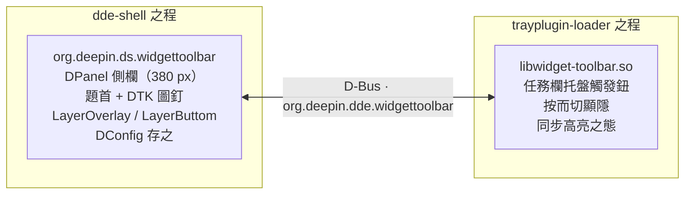

<div align="center">

# 🧩 深之度小组件欄（deepin-widget-toolbar）


deepin 桌面之側欄也，仿 Vista 之制，依 dde-shell 插件之體。

</div>

🌐 **諸文**: [English](README.md) | [簡體中文](README.zh-Hans.md) | [文言](README.zh-Pre-Qin.md)

## 序

此器者，小组件欄也。居屏之右，廣三百八十素，與通知中心同寬。欄首有題，其右有圖釘之鈕，可按而置頂置底：置頂則恆居萬窗之上，置底則凡窗皆可覆之。任務欄復有鈕焉，按之則欄顯，再按之則欄隱，此外無他途可闔。故雖點欄外之空處，欄終不閉。顯隱之態與置頂之態，皆記之於 DConfig，重啟而復焉。屏之多者，欄隨任務欄所居之屏而徙。

## 能

- **側欄**：常居屏右，廣三百八十素，與通知中心同寬
- **網格**：四列之格，縱向無窮可滾（DDE 樣式滾條，閒則自隱）；組件以 `cols × rows` 占格
- **拖放與整理**：長按可移組件至任意格（含非首列）；位既存，不強行補位；拖曳時所占者實時避讓，或上或下、數件聯動而動畫，移開或止則復位；左下"整理"之鈕，按左上優先壓實
- **加添**：下方"添加"之鈕，彈出面板（毛玻璃、系統圓角、圓叉而闔、無題無欄），列內置與已加者，可入 `.dwpkg`（tar.xz）之包，可卸第三方之件
- **右鍵**：組件之上右鍵，可改尺寸（`1×1` / `2×2` / `4×2` / `4×4`）、開其例之設、去其顯示
- **內置**：時鐘（數字/指針）、曆、系統之監（凡尺寸皆可擇 CPU/內存/磁盤/GPU/NPU 之顯，可示所啟之全部；二乘二單列，四乘二與四乘四默雙列；刷新可擇一秒、二秒、五秒而默五秒；後台按需采樣；進度條輕而無動畫）、便箋（每例各存其文）、世界之時（數字或隨尺寸而變之指針表盤網格，時區與地區之名隨控制中心時間之設）、頻譜之面（隨系統所播之音而躍，幅與色可設，默淡綠之底、主題之色）、可擇字體顏色之端闈樂部歌詞，及播放之控（MPRIS 之曲、封，前曲/播停/後曲，可自動或鎖定播放器）。時鐘與世界之時並預載時刻（默啟）：諸表共享宿主一己之秒鐘，表盤靜者先繪，指針以 GPU 旋之，多盤並動而不滯。凡內置組件皆可逐色而設（一默色加自選），並有透明背景之闕（默閉），色不合法則退默
- **開宗**：manifest（`sizes` + `settings`）+ 例之上下文（`dataDir`/`instanceId`/`widgetConfig`）+ 宿主之能（`FileIO`/`SystemInfo`/`Lyrics`/`ClockTime`/`MediaPlayers`/`MediaPlayer`/`AudioVisualizer`），詳見 [widget-api.md](widget-api.md)
- **置頂/置底**：欄首 DTK 圖釘之鈕，置頂則恆居萬窗上（`LayerOverlay`），置底則凡窗可覆（`LayerButtom`）
- **任務欄鈕**：dde-dock 托盤插件，按之顯隱——此為顯隱唯一之途，失焦不自閉
- **存**：`visible` 與 `pinned` 記於 DConfig，重啟而復；組件之單存於 `~/.local/share/org.deepin.ds.widgettoolbar/installed.json`，每例之設另存於其數據之目
- **諸文**：QML 皆用 `qsTr`，廿三種語言之 `.ts`（簡體已譯）
- **多屏**：欄隨任務欄所在之屏

## 架

二插件以會話總線 D-Bus 相通信：



- **欄**（`panel/`）：dde-shell `DPanel` 插件（`org.deepin.ds.widgettoolbar`），登 D-Bus 之務 `org.deepin.dde.widgettoolbar`，具 `toggle()` / `show()` / `hide()` 之法及 `visible` / `pinned` 之性。
- **托盤鈕**（`tray/`）：dde-tray-loader 插件（`PluginsItemInterfaceV2`，`Type_Tray`），為 D-Bus 之客，切欄顯隱而應其態。

## 需

- deepin / UOS v25，dde-shell 2.0.52+（運行時）
- Qt 6.8+ 與 DTK 6 開發之包
- `libdde-shell-dev`（2.0.52）
- dde-tray-loader 2.0.38（運行時，托盤插件所須）

## 構

先備上之所須，然後：

```bash
cmake -S . -B build
cmake --build build -j$(nproc)
```

## 裝

```bash
sudo ./install.sh          # cmake --install build
systemctl --user restart dde-shell@DDE
```

## 用

1. 點任務欄托盤區之鈕，欄或顯或隱。
2. 點欄首之圖釘，欄或置頂或置底：
   - **置頂**：恆居萬窗之上，點欄外之空處亦不閉。
   - **置底**：凡窗皆可覆之。
3. 顯隱與置頂之態，重啟不失。

## 限

- **置底不復縮工作區**：置底時欄不再向合成器稱 `exclusionZone`（X11 則為 `_NET_WM_STRUT_PARTIAL`，Wayland 則狹他人 layer-shell 窗之域）。昔者工作區為縮，全屏/最大化之窗緣露黑邊；今去之，則復其常，置底唯存"可為凡窗所覆"之義。
- **桌面圖標不避欄**：dde-desktop 之可用域唯以「屏幾何 − dock 之 frontendWindowRect」計，不讀工作區/strut。故置底時欄覆屏右一列之圖標，插件側無術可改——欲使避讓，必改 dde-file-manager 之 `ScreenQt::availableGeometry()`（本插件明言不為此變）。

## 驗

- 欄現於屏右，廣三百八十素，有題與圖釘。
- 任務欄之鈕切欄顯隱，其高亮隨欄之態。
- 置頂則凡窗不覆；置底則可覆。
- 點欄外之空處不閉。
- 時鐘與歌詞之例設，改之即效，重啟不失。
- 重啟而態存。
- 右鍵組件，唯現其 manifest 所允之尺寸；改之則存而不失，他件避讓不疊；"取消顯示"則去其例。
- 系統之監，進度條輕而無動畫，不溢其格；二乘二單列，四乘二與四乘四默雙列，凡尺寸皆可示所啟之全部，單列者自動斂其行距行高；采樣默五秒，行於後台，欄隱則止；雙列之設見於四乘二與四乘四。
- 時鐘與世界之時默用預載時刻：凡可見之時鐘共宿主一己之秒鐘，指針唯轉不重繪；關其設則退為各例自定時。
- 頻譜之面隨系統所播之音而躍（默 sink 之監聽回環），唯例見時方采；幅（四成至二倍）與色可設，默淡綠之底、主題之色；無聲則徐呼吸以待。
- 世界之時，新例默指針之式而預置四盤：本時區一，老四樣（北京/東京/倫敦/紐約）之三；設中盡去其盤，則不復補。
- 內置組件初用即施默色；改色或啟透明背景，立效而重啟不失，非法之色退默無害。

## 目

```
deepin-widget-toolbar/
├── CMakeLists.txt          # 頂層構建（panel 與 tray）
├── install.sh              # 系統安裝之文
├── uninstall.sh            # 卸載之文（與 install.sh 相配）
├── build-deb.sh            # Debian 打包之文（臨副本 dpkg-buildpackage → dist/）
├── LICENSE                 # GNU GPL v3 全文
├── debian/                 # Debian 打包之設（control/rules/postinst/postrm）
├── docs/                   # 文檔
│   ├── README.md           # 英文
│   ├── README.zh-Hans.md   # 簡體中文
│   ├── README.zh-Pre-Qin.md# 文言（先秦文風）
│   ├── widget-api.md       # 小組件開放接口之範（v1.2）
│   └── system-monitor.md   # CPU/內存/磁盤/GPU/NPU 之源與算法
├── panel/                  # dde-shell DPanel 插件
│   ├── CMakeLists.txt      # 欄之構建（Dde::Shell + 翻譯 + 安裝）
│   ├── widgettoolbarpanel.*# DPanel + D-Bus 之務（顯隱/置頂/菜單之動）+ 組件之宿主
│   ├── widgetmanager.*     # 組件之掃 / installed.json / 網格槽 / .dwpkg 之入
│   ├── widgetmodel.*       # 組件清單之模（添加面板）
│   ├── fileio.*            # 宿主之能：文之讀寫（QML 單例）
│   ├── systeminfo.*        # 宿主之能：CPU/內存/磁盤 IO/GPU/NPU（QML 單例）
│   ├── lyricssource.*      # 宿主之能：端闈樂部歌詞（A/B 雙緩，QML 單例）
│   ├── clocktime.*         # 宿主預載時源：按整秒而齊之唯一秒鐘（QML 單例）
│   ├── widgetresources.qrc # 內置組件資源之註
│   ├── configs/            # DConfig 元數據
│   ├── translations/       # 欄之翻譯（廿三語 .ts）
│   └── package/            # QML 之面
│       ├── metadata.json   # 欄插件元數據（dde-shell）
│       ├── main.qml        # 側欄：四列網格 + 拖放 + 滾動 + 右鍵菜單 + 互斥彈出
│       ├── AddWidgetPopup.qml  # 添加組件彈出之面（PanelPopup 之體）
│       ├── SettingsDialog.qml  # 設置彈出之面（顯欄/置頂）
│       ├── AboutPopup.qml  # 關於彈出之面（團隊/倉庫/官網之鏈）
│       ├── WidgetSettingsPopup.qml # 依 manifest schema 而生成之例設面板
│       ├── PopupHeader.qml  # 面板共用之題欄
│       ├── PinButton.qml   # 置頂之鈕
│       ├── icons/          # 置頂/置底圖釘之圖
│       └── widgets/        # 內置組件與共用 WidgetCard / ColorUtils 之件
└── tray/                   # dde-tray-loader 插件
    ├── CMakeLists.txt      # 托盤插件構建（Qt6 + DTK6 + 翻譯 + 安裝）
    ├── metadata.json       # 插件元數據（api 2.0.0）
    ├── widgettoolbartrayplugin.*  # PluginsItemInterfaceV2 + 右鍵菜單 + 控制中心插件區之門
    ├── traybutton.*        # 任務欄鈕 + D-Bus 之客
    ├── interfaces/         # vendored dde-tray-loader 2.0.38 頭文件
    ├── translations/       # 托盤插件翻譯（en/zh_CN .ts）
    └── icons/              # 圖之資產
        ├── widget-toolbar.svg         # 白圖（暗主題）
        ├── widget-toolbar-dark.svg    # 黑圖（明主題）
        ├── widget-toolbar-icons.qrc   # QRC 之註（前綴 /widget-toolbar，避 DTK 符號之爭）
        └── dcc-widget-toolbar.dci     # 控制中心插件區之圖（DCI 之器，明暗雙題）
```

## 文

斯文有三：英文為正，簡體為輔，此文以先秦文言述之，三文互為援引，所載並同，覽者擇其宜焉。

## 律

此器行 GNU GPL v3.0 之律，全文見 [LICENSE](../LICENSE)。`tray/interfaces/` 之頭文件出自 [dde-tray-loader](https://github.com/linuxdeepin/dde-tray-loader)，行 LGPL-3.0-or-later 之律，詳見文件之首。
